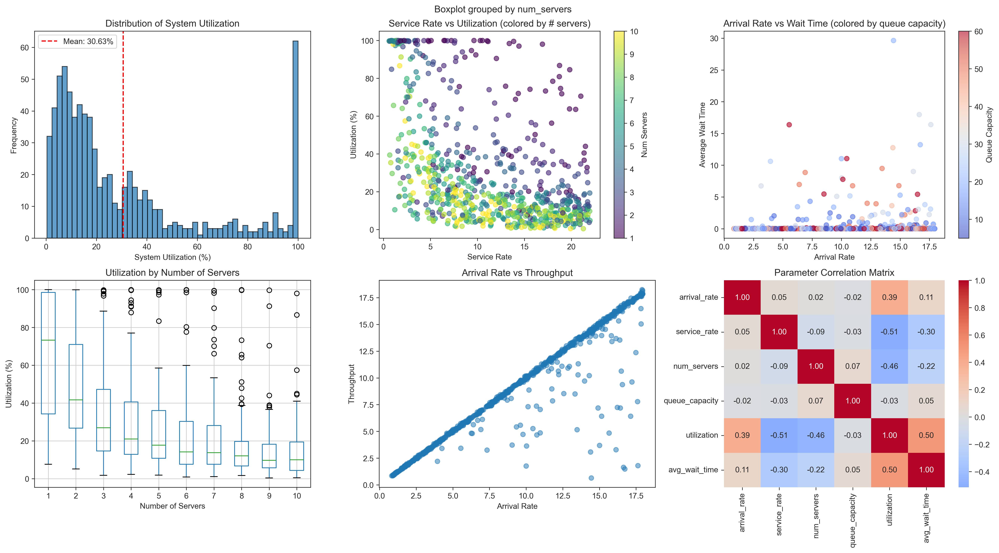
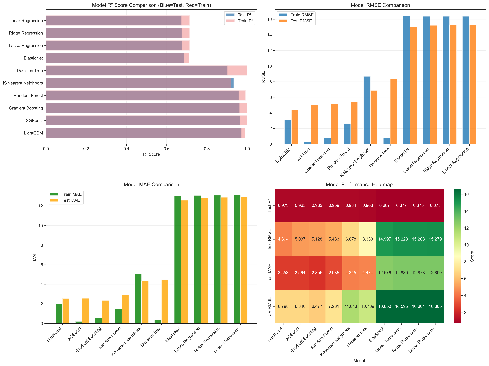
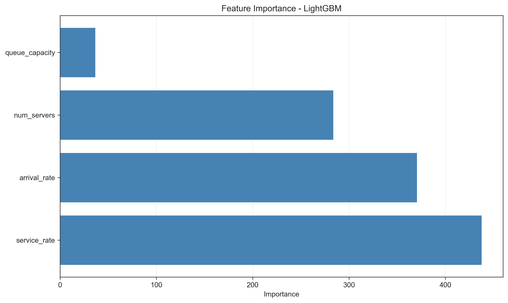
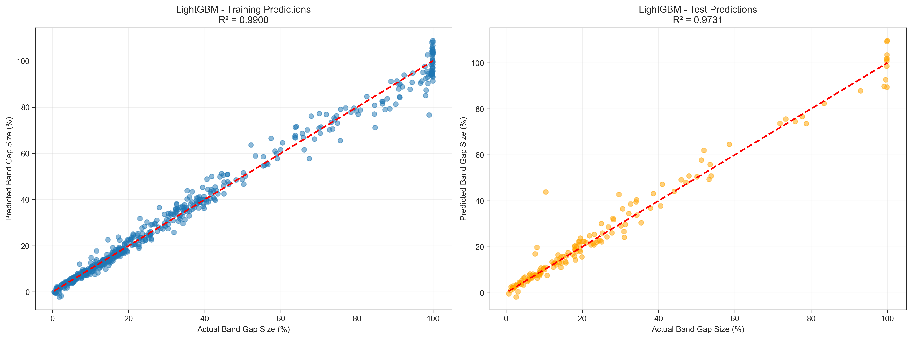

# Service System Simulation & Machine Learning Analysis

## Overview

This project demonstrates discrete-event simulation using **SimPy** to model a multi-server queueing system, followed by machine learning regression analysis to predict system performance metrics from configuration parameters.

**Student Name**: PUSHKAR MANOCHA
**Roll Number**: 102303751 
**Assignment**: PAS Assignment - Simulator Exploration & ML Model Comparison  
**Date**: January 2026  
**Simulator**: SimPy 4.1.1 (Discrete-Event Simulation Framework)

## Objectives

1. Install and explore SimPy discrete-event simulator
2. Identify key simulation parameters and their operational bounds
3. Generate 750 simulation runs with randomized parameters
4. Train and compare 10 machine learning regression models
5. Report best-performing model based on evaluation metrics

## System Model

**Multi-Server Queueing System** (Manufacturing/Call Center/Service System)

### Input Parameters

| Parameter         | Range                               | Description                             |
| ----------------- | ----------------------------------- | --------------------------------------- |
| `arrival_rate`    | [0.8, 18.0]                         | Customer arrival rate (per time unit)   |
| `service_rate`    | [0.6, 22.0]                         | Service completion rate (per time unit) |
| `num_servers`     | [1, 10]                             | Number of parallel service channels     |
| `queue_capacity`  | {5, 10, 15, 20, 25, 30, 40, 50, 60} | Maximum queue size                      |
| `simulation_time` | 900                                 | Fixed simulation duration (time units)  |

### Output Metrics

- **Utilization** (Primary Target): System resource efficiency (%)
- **Average Wait Time**: Mean customer waiting duration
- **Throughput**: Customers served per time unit
- **Service Level**: Percentage meeting SLA targets (wait ≤ 4.0 time units)
- **Rejection Rate**: Percentage of customers rejected due to capacity

## Installation

### Prerequisites

```bash
Python 3.8+
pip package manager
```

### Setup

```bash
# Clone repository
git clone <repository-url>
cd 3_sim

# Install dependencies
pip install simpy numpy pandas matplotlib scikit-learn scipy seaborn xgboost lightgbm
```

## Usage

### Option 1: Run Jupyter Notebook (Recommended)

```bash
jupyter notebook mpb_simulation_2.ipynb
```

Execute cells sequentially to:

- Generate 750 simulations
- Visualize data distributions and correlations
- Train 10 ML models
- Compare model performance

### Option 2: Run Standalone Simulation

```bash
python simpy_simulation.py
```

Generates 100 sample simulations for testing.

## Project Structure

```
3_sim/
├── mpb_simulation_2.ipynb              # Main analysis notebook
├── simpy_simulation.py                 # Standalone simulation framework
├── simpy_simulation_data.csv           # Generated dataset (750 runs)
├── model_comparison_results.csv        # ML model performance metrics
├── data_exploration.png                # Parameter distribution plots
├── feature_importance.png              # Feature importance visualization
├── model_comparison_visualization.png  # Model performance comparison
├── best_model_predictions.png          # Best model predictions plot
└── README.md                           # This file
```

## Machine Learning Models

### Models Evaluated

1. Linear Regression
2. Ridge Regression
3. Lasso Regression
4. Elastic Net
5. Decision Tree Regressor
6. Random Forest Regressor
7. Gradient Boosting Regressor
8. XGBoost Regressor
9. LightGBM Regressor
10. K-Nearest Neighbors (KNN) Regressor

### Evaluation Metrics

- **R² Score**: Coefficient of determination (model fit quality)
- **RMSE**: Root Mean Squared Error (prediction accuracy)
- **MAE**: Mean Absolute Error (average prediction deviation)
- **CV-RMSE**: Cross-validated RMSE (generalization capability)

## Results

**Best Model**: _[View model_comparison_results.csv for detailed rankings]_

The analysis includes:

- Comprehensive data exploration with correlation analysis
- Feature importance rankings
- Train/test performance comparison
- Cross-validation scores for robustness assessment
- Visual comparison of all 10 models

### Data Exploration


_Parameter distributions and correlation heatmap showing relationships between simulation inputs and outputs_

### Model Performance Comparison


_Comparative analysis of 10 machine learning models across R², RMSE, MAE, and CV-RMSE metrics_

### Feature Importance Analysis


_Relative importance of input parameters in predicting system utilization_

### Best Model Predictions


_Actual vs. Predicted values for the best-performing model with residual analysis_

## Key Findings

- Strong correlation between arrival rate, service rate, and system utilization
- Non-linear relationships require ensemble methods for optimal prediction
- Model performance varies significantly based on metric priorities
- Cross-validation essential for assessing generalization
- Tighter SLA threshold (4.0 time units) impacts service level metrics

## Author

**PUSHKAR MANOCHA**  
Roll Number: 102303751  
PAS Assignment - January 2026

